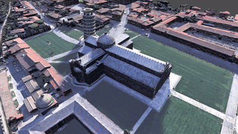
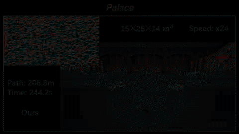

    <h1>
        
        FC-Family: Advancing Aerial Robots Beyond Mobility
    </h1>

  &nbsp;&nbsp;&nbsp;&nbsp;
  &nbsp;&nbsp;&nbsp;&nbsp;
  

  &nbsp;&nbsp;&nbsp;&nbsp;
  &nbsp;&nbsp;&nbsp;&nbsp;
  

## 🤓 What is [FC-Family](https://github.com/FC-Family)?

We aim to develop aerial robots that can operate robustly and intelligently in open-world environments, with a particular focus on expanding their capabilities beyond mobility to skills such as active perception and dexterous manipulation.

## 🧑‍🔬 Core Contributors

[Chen Feng](https://chen-albert-feng.github.io/AlbertFeng.github.io/), [Haojia Li](https://li-hj.com/), [Guiyong Zheng](https://gy920.github.io/), [Yang Xu](https://jason-xy.cn/), [Mingjie Zhang](https://zager-zhang.github.io/), ...

## 📖 Project List

* [PredRecon](https://github.com/HKUST-Aerial-Robotics/PredRecon) (ICRA 2023): Prediction-boosted Planner for Aerial Reconstruction.
* [FC-Planner](https://github.com/HKUST-Aerial-Robotics/FC-Planner) (ICRA 2024 **Best UAV Paper Award Finalist**): Highly Efficient Global Planner for Aerial Coverage.
* [SOAR](https://github.com/SYSU-STAR/SOAR) (IROS 2024): Heterogenous Multi-UAV Planner for Aerial Reconstruction.
* [FC-Vision](https://github.com/FC-Family/FC-Vision) (RA-L 2026): Online Visibility-aware Replanning for Occlusion-free Aerial Scanning.
* [FlyCo](https://github.com/FC-Family/FlyCo): Complete and Prompt-Driven System for Open-World Active Perception.
* [FC-CLAMP v0.1](https://www.bilibili.com/video/BV1B8bv66ERV/?spm_id_from=333.1387.homepage.video_card.click): Learning Whole-Body Coordination for Aerial Manipulation in Minutes.
* **...**
